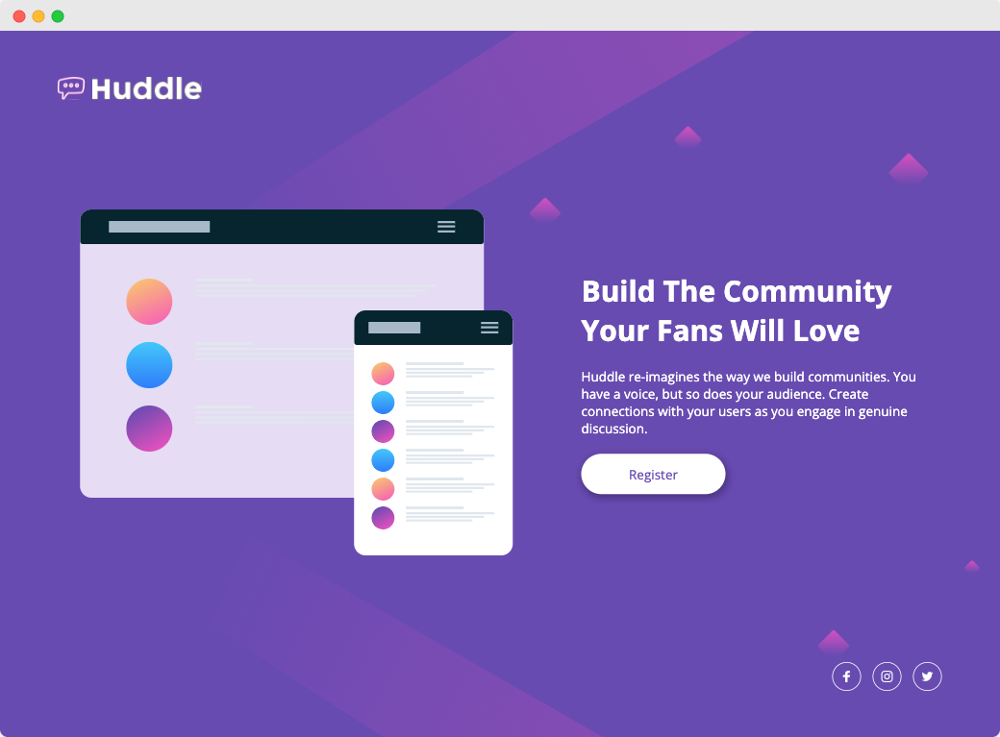

# FrontendMentor Challenge | Huddle Langing Page

This is a challenge from FrontendMentor.   
You can find the description of the task here:   
[frontendmentor.io](https://www.frontendmentor.io/challenges/huddle-landing-page-with-a-single-introductory-section-B_2Wvxgi0)



My goal in this challenge was to:
- do the challenge as fast as possible
- use webpack together with gulp
- make the background with scss only

### How to run
```bash
git clone https://github.com/jeromehaas/huddle-langing-page-fm
cd huddle-landing-page-fm
nvm use
npm install 
npm start
```